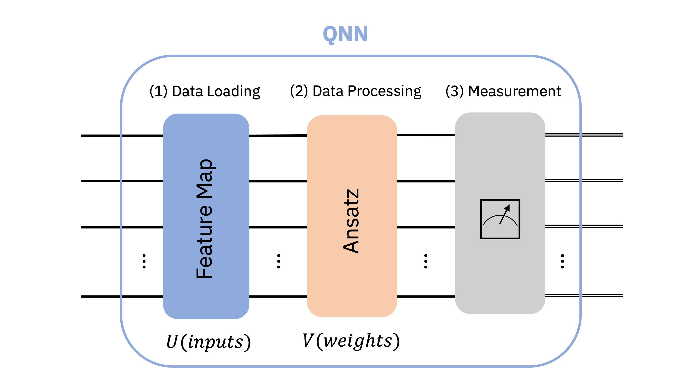
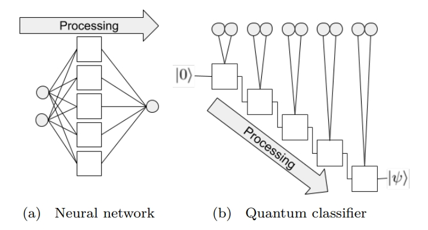
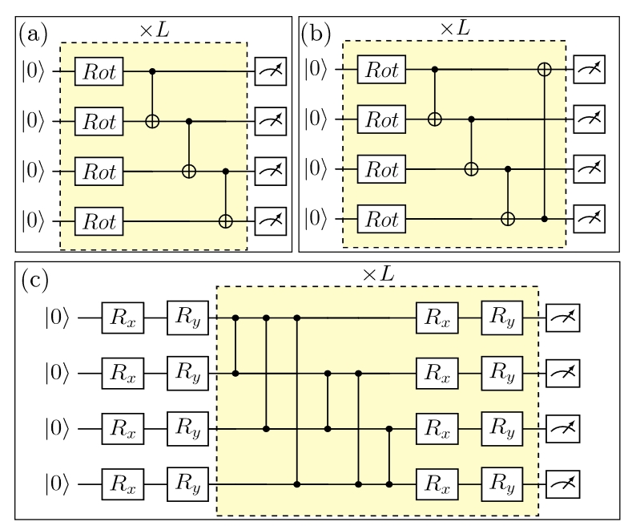
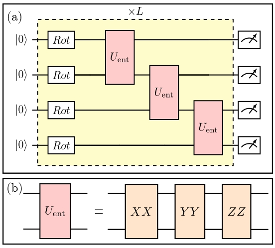
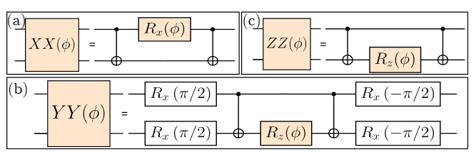
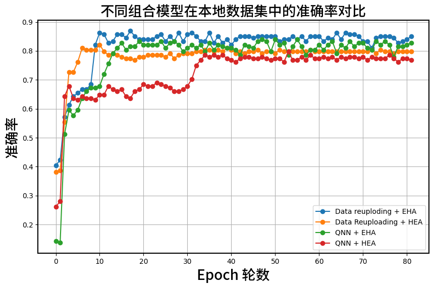

## 全国先进计算技术大赛 A1赛道 爱如火队 技术文档
### 1.数据处理部分  
本赛题可以被概括为量子机器学习任务中的三分类任务，以处理此类任务的经典QNN模型为例(如下图)，需要将经典数据转换成量子态载入量子线路中。这个过程被称为"经典数据嵌入（Data Embedding）".官方数据集表达Oracle的是方式是使用16对键值对的字典，用以表达的Orcale函数关系，在这里小组主要使用了振幅编码方案。  
然而在确定了编码方式后，**如何应用Data Embedding层有两种方式**:  

1. 采用QNN结构，只采用1层数据加载层。  
2. 采用Data re-uploading 方案，数据加载层、Ansatz层交替使用    
<div align=center></div>
<center>QNN结构示意图</center>
<div align=center></div>
<center>Data re-uploading结构示意图</center>
小队在数据处理部分主要使用了振幅编码方案，在数据加载方式上**对比了QNN模型、Data reuploading模型**.


### 2.参数化电路设计思路: EHA Ansatz
由于量子机器学习(QML)任务，是一类没有先验知识的任务，并且其量子部分往往基于量子变分算法(VQA)。而变分量子线路(Ansatz)的设计会显著影响VQA的算法性能，因此Ansatz的设计尤为关键。Hardware-Efficient Ansatz是一种VQA算法中常用的Ansatz，由于其不需要先验知识、面向通用型任务，因此非常适合作为同样没有先验知识QML任务中的Ansatz。  
然而相关研究指出，**HEA的Ansatz设计存在以下缺陷**:  
1. 浅层HEA表达性差，无法有效探索Hilbert空间
2. 深层HEA参数过多，经典优化困难，陷入优化的贫瘠高原(Barren Plateau)
3. HEA中的纠缠部分固定，限制了纠缠的自由度  

<div align=center></div>
<center>硬件高效型拟设(HEA) 示意图</center>

由于其在量子纠缠块的规律性设置，导致其降低了纠缠度的灵活性，因此近期发表的一篇论文[^1]提出了一种更高自由度的硬件高效型Ansatz，被称为变分纠缠硬件高效型拟设(Entangle-Variational Hardware Efficient Ansatz EHA), EHA变分量子线路方案作为一种改进型的HEA，主要**改进了其“纠缠度自由度低”这一核心问题，有以下优点**:
1. 通过纠缠变分的方式，使得纠缠块所提供的纠缠度不再固定,更具有纠缠自由度
2. 同样是硬件高效型拟设、面向无先验知识的通用任务
3. 对于初始量子态更具有鲁棒性      

   
下图是纠缠变分量子拟设(EHA)的示意图，可以看出其使用了含变分参数的纠缠块来代替HEA中的纠缠门，因此通过调整纠缠块的变分参数大小，可以动态调节Ansatz的总体纠缠度。
<div align=center></div>
<div align=center></div>
<center>变分纠缠硬件高效型拟设(EHA) 示意图</center>

### 3.实验结果分析  
#### 3.1 实验对比
小组横向对比了两种数据编码层级、两种Ansatz，共4种组合方式:

<center>

|组合序号|  数据编码方式   | 数据编码结构 | 拟设类型| 准确率acc|
|:-----:|:-----:|:-----:|:-----:|:-----:|
| 1  | 振幅编码 | QNN | HEA |**76.79%**|
| 2  | 振幅编码 | QNN | EHA |**82.73%**|
| 3  | 振幅编码 | Data -reuploding | HEA |**79.76%** |
| 4  | 振幅编码 | Data -reuploding | EHA |**85.12%** |

</center>


上图的表格汇总展示了4种不同组合的模型性能，其核心表现可以用下图可视化表达。
<div align=center></div>
<center>4种组合方式的训练情况，超参数保持一致</center>

#### 3.2 实验结果分析
从上图可以看出**Data-reuploading 方案相较于QNN模型方案 准确度更高！**  
在相同模型结构下,**EHA 量子线路的准确度高于HEA量子线路的方案**,实验证明EHA量子线路确实通过变分纠缠的方式，**增大了纠缠度的灵活性，表达性更加高**。


### 4.关键代码分析  
#### 4.1. 数据预处理部分:   

由于黑盒函数Orcale使用了字典进行表达，因此在main.py中,接连使用了basis_enoding、get_tensor 函数对字典数据集进行了编码,编码后得到了代表Oracle的“特征向量”。因此在真正进行数据嵌入时，得到的数据尺寸是Tensor.shape = [batch_size,1,16]  main.py的其他部分属于常见的机器学习任务通用代码，不再分析
```python
def get_tensor(data, labels=None):
    x_lst = []
    y_lst = []
    for i in range(len(data)):
        x = torch.tensor(basis_encoding(data[i], n=n))
        if labels == None:
            y = torch.tensor(-1)
        else:
            y = torch.tensor(labels[i])
        x_lst.append(x)
        y_lst.append(y)
    return torch.stack(x_lst), torch.stack(y_lst)

x_train, y_train = get_tensor(TRAIN_DATA, TRAIN_LABELS)
x_val, y_val = get_tensor(VAL_DATA, VAL_LABELS)

trainset = TensorDataset(x_train,y_train)
valset = TensorDataset(x_val,y_val)

```

#### 4.2. 变分量子线路的实现部分：
1. 硬件高效型拟设(HEA):
硬件高效型拟设是一类非常常用的变分量子线路设计，在此不过多赘述，实现如下:  
值得注意的是,由于面对的是三分类问题，因此需要在结尾处安排三个比特的测量作为分类输出。

    ```python
    def circuit(self):
        for i in range(2):
            self.cir.rzlayer()
            self.cir.cnot_ring()
            self.cir.rylayer()
            self.cir.cnot_ring()
            self.cir.barrier()
        self.cir.rzlayer()
        for i in range(3):
            self.cir.observable(i)
        
    ```

2. 纠缠变分硬件高效型拟设(EHA):
模型circuit的定义如下，在这里将“变分纠缠块”使用函数: self.pauliEblock() 函数进行实现,且本质上代替了HEA中的纠缠门
   ```python
       def circuit(self):
            for i in range(1):
                self.cir.rylayer()
                self.pauliEblcok(self.cir,0,1)
                self.cir.barrier()
                self.pauliEblcok(self.cir,2,3)
                self.cir.barrier()
                self.pauliEblcok(self.cir,3,4)
                self.cir.barrier()

            for i in range(3):
                self.cir.observable(i)
   ```  
    而根据相关EHA的文章[^1]中的数学定义，实现变分纠缠块的函数定义如下:

    ```python
        def pauliEblcok(self,cir,n1,n2):
            #####Pauli-XX####
            cir.cx(n1,n2)
            cir.rx(n1)
            cir.cx(n1,n2)
            #####Pauli-YY#######
            cir.rx(n1,np.pi/2)
            cir.rx(n2,np.pi/2)
            cir.cx(n1,n2)
            cir.rx(n2)
            cir.cx(n1,n2)
            cir.rx(n1,-np.pi/2)
            cir.rx(n2,-np.pi/2)
            #####Pauli-ZZ#####
            cir.cx(n1,n2)
            cir.rx(n2)
            cir.cx(n1,n2)    
    
    ```
#### 4.3. 模型训练的超参数部分：  
由于模型的表现性能和超参数的调整也有着密切关系，但由于其的不确定性，在此不过多讨论仅做展示：

    ```python
    # global settings
    n = 4
    batch_size = 16
    num_classes = 3
    num_epochs = 100
    ```  


[^1]: [EHA: Entanglement-variational Hardware-efficient Ansatz for Eigensolvers](http://arxiv.org/abs/2311.01120)